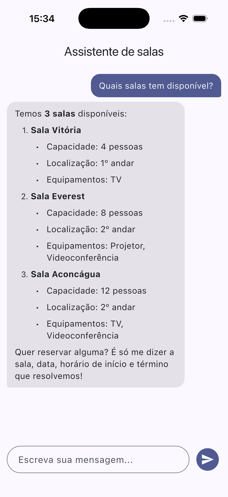
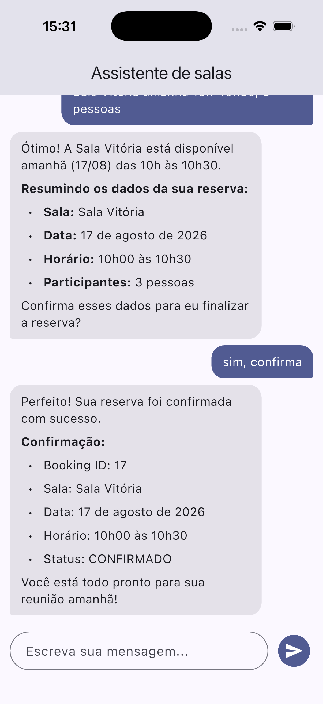
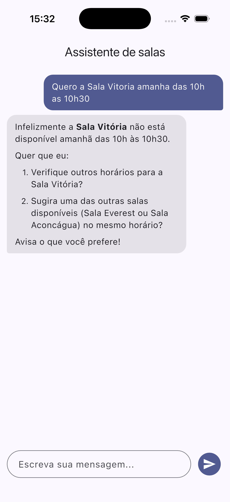
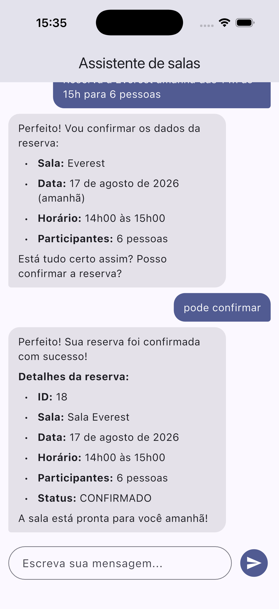
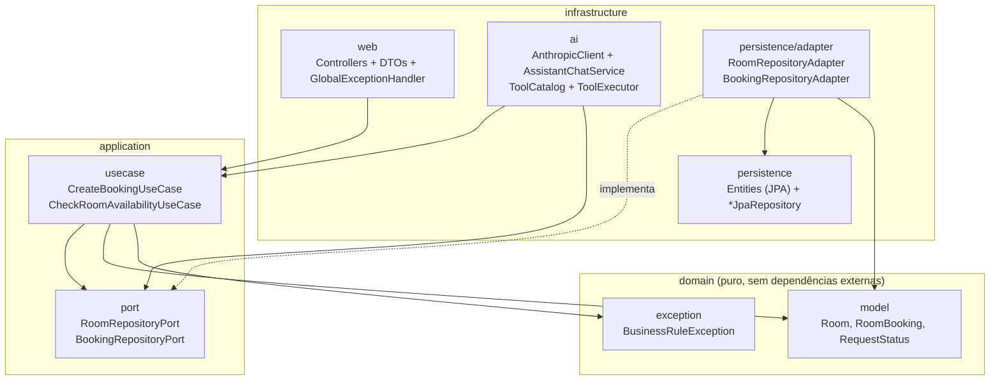
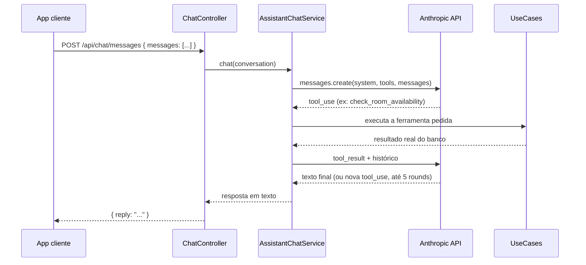

# Flow Assistant Backend

Backend do **Flow Assistant**: um assistente de reserva de salas de reunião que
conversa em linguagem natural. O usuário fala com o assistente como falaria
com uma pessoa ("Reserva a Everest amanhã das 14h às 15h para 6 pessoas"), e
o backend usa a API da Anthropic (Claude) com *tool calling* para consultar
disponibilidade real e criar a reserva no banco, nada é inventado pela IA.

Este repositório é só a API, o cliente é um app de chat que consome os
endpoints abaixo.

## Screenshots

Fluxos reais do assistente conversando com a API (cliente de chat sobre os
endpoints deste backend):

| Listar salas | Reserva rápida ("agora mesmo") | Agendamento confirmado |
|---|---|---|
|  |  |  |

| Horário indisponível | Agendar para amanhã | Pergunta fora de escopo |
|---|---|---|
|  |  |  |

## O que ele faz

- Conversa em português, entende pedidos informais ("preciso de uma sala
  agora mesmo, rápido, pra 2 pessoas") e só pergunta o que realmente falta
  (sala, data, horário de início/fim são obrigatórios; participantes e
  finalidade são opcionais).
- Recusa educadamente perguntas fora do assunto (conhecimentos gerais,
  código do sistema) e redireciona pro que sabe fazer.
- Nunca alucina reserva: toda resposta de sucesso vem de uma chamada real à
  ferramenta `create_booking`, com o resultado do banco.
- Aplica as regras de negócio no backend, não na IA: a IA decide *o quê*
  chamar, o backend decide *se pode*.
- Guarda o histórico da conversa no cliente e reenvia a cada mensagem, então
  o assistente lembra o contexto dentro da mesma conversa.

## Arquitetura

Clean Architecture em 3 camadas com **inversão de dependência** entre a
aplicação e a persistência: os use cases dependem de **ports** (interfaces
definidas na própria camada `application`) e falam apenas em termos de
domínio. Quem implementa essas ports são **adaptadores** na infraestrutura,
que traduzem entidade JPA ↔ modelo de domínio. Assim os use cases não
conhecem JPA, Spring Data nem HTTP, a seta de dependência aponta pra dentro.



Repara que **nada em `application` aponta pra `infrastructure`**, os
adaptadores é que apontam pra dentro (implementam as ports e retornam
domínio). Os use cases são classes Spring simples, sem uma abstração
genérica de "UseCase" por cima delas.

- **domain**, regras e modelos puros (ex: `RoomBooking.conflictsWithBuffer`,
  `hasCapacityFor`), sem depender de Spring, JPA ou HTTP.
- **application**, casos de uso (`CreateBookingUseCase`,
  `CheckRoomAvailabilityUseCase`) e as **ports** de saída
  (`RoomRepositoryPort`, `BookingRepositoryPort`) que eles usam pra falar
  com a persistência sem conhecê-la.
- **infrastructure**, tudo que fala com o mundo externo: os **adaptadores**
  de persistência que implementam as ports (`RoomRepositoryAdapter`,
  `BookingRepositoryAdapter`) sobre JPA + Flyway, REST (`BookingController`,
  `RoomController`, `ChatController`) e a integração com a Anthropic (`ai/`).

### Integração com a IA (tool calling)

O `AssistantChatService` roda um loop agente contra a Anthropic Messages API:



Ferramentas expostas pela IA (`ToolCatalog`):

| Tool | Parâmetros | O que faz |
|---|---|---|
| `list_rooms` |, | Lista salas ativas (nome, capacidade, localização, equipamentos) |
| `check_room_availability` | `room_name`, `date`, `start_time`, `end_time` | Verifica se a sala está livre no intervalo |
| `create_booking` | `room_name`, `date`, `start_time`, `end_time`, `attendees_count?`, `purpose?` | Cria a reserva, só depois do usuário confirmar os dados |

> **Por que `while` e não `if`, por que o histórico vive no cliente, por que
> existe uma "REGRA CRÍTICA" no prompt**, cada decisão de design do loop
> acima, com o bug real que motivou ela, está detalhada em
> [`docs/tool-calling.md`](docs/tool-calling.md).

### Qual modelo e por quê

O modelo é configurável (`anthropic.model` em `application.yaml`, hoje
`claude-haiku-4-5`) e nunca aparece hardcoded no código, `AssistantChatService`
sempre lê de `properties.model()`, então trocar de modelo é mudar uma linha
de config, não uma linha de Java.

**Por que Haiku 4.5 e não Sonnet:** essa é uma tarefa de conversa curta e
bem guiada, o assistente segue um roteiro (listar → checar disponibilidade
→ confirmar → criar), não faz raciocínio aberto nem análise complexa. Um
modelo mais barato e mais rápido dá conta bem, e qualquer erro de
interpretação do modelo é pego de qualquer forma pelas regras de negócio no
backend (ver seção acima), a IA nunca é a última linha de defesa. Se o
escopo crescer pra algo que exija mais raciocínio, trocar pra Sonnet é só
mudar o valor de `anthropic.model`.

| Modelo | Input (1M tokens) | Output (1M tokens) |
|---|---|---|
| Claude Haiku 4.5 (`claude-haiku-4-5`), em uso | US$ 1,00 | US$ 5,00 |
| Claude Sonnet 5 (`claude-sonnet-5`), alternativa se precisar de mais raciocínio | US$ 3,00 | US$ 15,00 |

**Custo real observado** (conta de desenvolvimento/testes, snapshot de
16/08/2026): US$ 0,39 gastos no mês, de um limite de US$ 200 mil (0%
usado). Nada surpreendente, cada requisição de chat tem poucas centenas de
tokens de entrada/saída, e o volume aqui é de testes manuais, não de
produção com uso real. Serve mais como referência de ordem de grandeza do
que como projeção de custo em escala.

A IA nunca decide sozinha se pode reservar: `CreateBookingUseCase` valida
tudo de novo no backend antes de gravar.

### Regras de negócio

Aplicadas em `CreateBookingUseCase` / `CheckRoomAvailabilityUseCase`,
independente do que a IA "ache":

- Horário comercial: reservas só entre **08:00 e 18:00**.
- Sem sobreposição: duas reservas na mesma sala não podem se cruzar,
  respeitando um **buffer de 10 minutos** entre uma reunião e outra.
- Capacidade: número de participantes não pode exceder a capacidade da sala.
- Sala precisa existir e estar ativa.

## Testes

```bash
./mvnw test
```

73 testes, só unitários e de slice (sem depender de um Postgres real rodando
pra passar, exceto o smoke test padrão do Spring Boot,
`FlowAssistantBackendApplicationTests`, que sobe o contexto inteiro):

| Camada | Classe | O que cobre |
|---|---|---|
| domain | `RoomTest`, `RoomBookingTest` | `hasCapacityFor`, `isWithinBusinessHours`, e principalmente `conflictsWithBuffer` nos limites exatos do buffer de 10 min (gap igual ao buffer não conflita, 1 min a menos conflita) |
| application | `CreateBookingUseCaseTest`, `CheckRoomAvailabilityUseCaseTest` | Todas as regras de negócio isoladas via Mockito, com as **ports** mockadas (sem JPA): campos obrigatórios, sala inexistente/inativa, capacidade, horário comercial, conflito, inclusive a ordem de validação (`checaDisponibilidadeAntesDeSalvar_ordemDeChamadas`) |
| infrastructure/persistence | `RoomRepositoryAdapterTest`, `BookingRepositoryAdapterTest` | O mapeamento entity ↔ domínio e o save em duas tabelas (envelope `requests` + `room_booking_requests`), com os `*JpaRepository` mockados |
| infrastructure/ai | `ToolExecutorTest` | Contrato JSON de cada tool, erro de negócio virando `{"error": ...}` em vez de exceção, ferramenta desconhecida, argumento faltando |
| infrastructure/ai | `AssistantChatServiceTest` | **O loop de tool calling em si**, 0/1/2 rounds encadeados, e o teste que trava o limite de `MAX_TOOL_ROUNDS` (6 chamadas à API, 5 execuções de ferramenta, fallback de erro). Ver [`docs/tool-calling.md`](docs/tool-calling.md) pro contexto de cada cenário |
| infrastructure/web | `GlobalExceptionHandlerTest` | Mapeamento de cada tipo de exceção pro status/mensagem HTTP certos, incluindo o caso 429 vs erro genérico |
| infrastructure/web | `BookingControllerTest`, `RoomControllerTest`, `ChatControllerTest` | Slice tests (`@WebMvcTest` + `MockMvc`), request/response JSON reais e a propagação de erro através do `GlobalExceptionHandler` de ponta a ponta |

Não há testes contra um Postgres real (`@DataJpaTest`), as queries dos
`*JpaRepository` (`findAllByActiveTrue`, `findByNameIgnoreCase`,
`findAllByRoomIdAndBookingDate`) são simples o bastante pra Spring Data
gerar a partir do nome do método, e o mapeamento em cima delas já está
coberto pelos testes dos adaptadores.

## Stack

- **Java 17** + **Spring Boot 4.1.0** (`spring-boot-starter-webmvc`,
  `spring-boot-starter-data-jpa`)
- **PostgreSQL** + **Flyway** (`spring-boot-starter-flyway`,
  `flyway-database-postgresql`), schema versionado, `ddl-auto: none`
- **Anthropic Claude** (`claude-haiku-4-5`) via chamada HTTP direta
  (`RestClient`) à Messages API, com tool calling
- Testes: `spring-boot-starter-data-jpa-test`,
  `spring-boot-starter-webmvc-test`

## Estrutura do projeto

```
src/main/java/br/com/flow_assistant/
├── domain/
│   ├── model/            Room, RoomBooking, RequestStatus
│   └── exception/        BusinessRuleException
├── application/
│   ├── usecase/          CreateBookingUseCase, CheckRoomAvailabilityUseCase
│   └── port/             RoomRepositoryPort, BookingRepositoryPort (interfaces)
└── infrastructure/
    ├── ai/                AnthropicClient, AssistantChatService, ToolCatalog, ToolExecutor, dto/
    ├── persistence/       entity/, repository/ (*JpaRepository), adapter/ (implementam as ports)
    └── web/               BookingController, RoomController, ChatController, GlobalExceptionHandler, dto/

src/main/resources/
├── application.yaml
└── db/migration/          V1__init_schema.sql, V2__seed_rooms.sql
```

## Como rodar localmente

### Pré-requisitos

- Java 17
- PostgreSQL rodando localmente (ou acessível via rede)
- Uma API key da [Anthropic](https://console.anthropic.com/)

### 1. Clonar e configurar o banco

Crie um banco/schema no Postgres compatível com o que está em
`application.yaml`:

```bash
psql -U postgres -c "CREATE DATABASE app_db;"
psql -U postgres -d app_db -c "CREATE SCHEMA IF NOT EXISTS flow_assistant_db;"
```

Ajuste `src/main/resources/application.yaml` com suas credenciais:

```yaml
spring:
  datasource:
    url: jdbc:postgresql://localhost:5432/app_db?currentSchema=flow_assistant_db
    username: SEU_USUARIO
    password: SUA_SENHA
```

O Flyway roda as migrations automaticamente no start da aplicação, não
precisa rodar nada manualmente. `V1__init_schema.sql` cria as tabelas
(`requests`, `rooms`, `room_booking_requests`) e `V2__seed_rooms.sql` já
insere 3 salas de exemplo.

### 2. Configurar a API key da Anthropic

O backend lê a key da variável de ambiente `ANTHROPIC_API_KEY`:

```bash
export ANTHROPIC_API_KEY="sk-ant-..."
```

> Sem essa variável, as chamadas ao `/api/chat/messages` retornam 401. Se
> preferir não depender do terminal a cada sessão, adicione o `export` ao seu
> `~/.zshrc`, ou crie um `application-local.yaml` git-ignorado com a key e
> rode com `--spring.profiles.active=local`.

### 3. Rodar a aplicação

```bash
./mvnw spring-boot:run
```

A API sobe em `http://localhost:8080`.

## Endpoints

| Método | Rota | Descrição |
|---|---|---|
| `GET` | `/api/rooms` | Lista as salas ativas |
| `GET` | `/api/rooms/{roomId}/availability?date=&startTime=&endTime=` | Verifica disponibilidade de uma sala |
| `POST` | `/api/bookings` | Cria uma reserva diretamente via REST (sem IA) |
| `POST` | `/api/chat/messages` | Conversa com o assistente, recebe `{ messages: [{role, content}, ...] }`, devolve `{ reply }` |

Exemplo de chamada ao chat:

```bash
curl -X POST http://localhost:8080/api/chat/messages \
  -H "Content-Type: application/json" \
  -d '{
    "messages": [
      { "role": "user", "content": "Reserva a Everest amanhã das 14h às 15h para 6 pessoas" }
    ]
  }'
```

## Roadmap

- Persistência de conversas no servidor (`conversations`/`messages` com
  `conversation_id`), hoje o histórico só existe no cliente.
- Cancelamento/alteração de reservas existentes (hoje o assistente
  reconhece o pedido mas informa que ainda não tem essa ferramenta).
